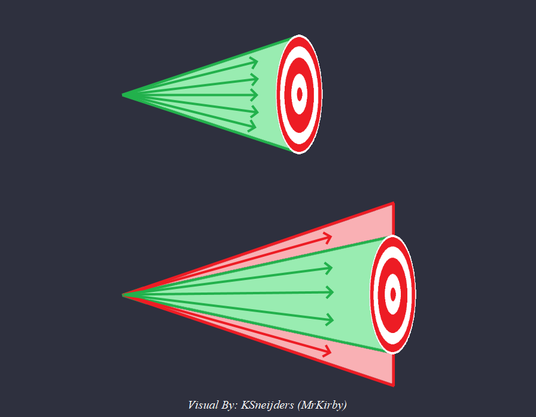

*Written by: Alian713*

---

This page is a list of all the unit attributes that can be modified in the scenario editor and their purposes. If you know of any attributes that are not written on this page, or if the descriptions of the attributes are wrong, please let the authors of this guide know!

## 0. Hit Points

 - ID: 0

 - This attribute refers to the health of the units

## 1. Line of Sight

 - ID: 1

 - This is the distance a unit can see around itself

## 2. Garrison Capacity

 - ID: 2

 - This is the amount of units that can garrison inside another unit

## 3. Unit Size X

 - ID: 3

 - This determines the x-size of the unit's collision hitbox (width of the unit)

## 4. Unit Size Y

 - ID: 4

 - This determines the y-size of the unit's collision hitbox (length of the unit)

## 5. Movement Speed

 - ID: 5

 - This is the movement speed of a unit, measured in tiles per second

## 6. Rotation Speed

 - ID: 6

 - This is the rate at which units can rotate, measured in seconds per frame (this many seconds must pass before the object can switch to the next rotation frame). For example, for a trebuchet to start attacking a building facing the opposite direction, it has to rotate to face that way first

## 8. Armor

 - ID: 8

 - This is the quantity of armour a unit has on any of its `Armour Classes`. If you do not know what an `Armour Class` is, refer to the [Damage Calculation](../damage_calculation "Jump to: Game Mechanics > Damage Calculation") section of this guide. Note that changing the armour through this option will show it as being added to the base armour amount. (for example: 4+4)

## 9. Attack

 - ID: 9

 - This is the quantity of attack a unit has on any of its `Attack Classes`. If you do not know what an `Attack Class` is, refer to the [Damage Calculation](../damage_calculation "Jump to: Game Mechanics > Damage Calculation") section of this guide. Note that changing the attack through this option will show it as being added to the base attack amount. (for example: 6+2)

## 10. Attack Reload Time

 - ID: 10

 - This is the minimum time that must pass before a unit is able to fire another shot. For melee units it is the minimum time between two successive hits that they can do

## 11. Accuracy Percent

 - ID: 11

 - This determines how accurately a unit can aim at another unit

 - This accuracy is the accuracy of a unit to fire at the exact centre of its target. If the shot fired is not aimed at the exact centre of the target, it may still hit the target if its not off by too much since it can still land within the hitbox of the target, just not at the exact centre

    Thus, bigger targets are actually easier to hit, which explains why buildings are an easier target to hit for trebuchets than small units

    

    In this image, you can see that shots that were fired in the red area in the 2nd scenario would've hit if the target had been closer like in the first scenario, but since the target is far away, they actually miss

    More technically, the visual angle of an object of the same size that is farther away is smaller, thus giving a smaller room for error for the shot in terms of the range of angles that will make the shot hit

    The chance of a unit getting converted by a monk is also determined by its accuracy

    If you modify an onager to have a big blast radius and give it a small accuracy, then attack a lot of units bunched together, the accuracy determines what percentage of units take damage from the blast of the onager! This is the reason why warwolf trebuchets get 100% accuracy because otherwise the blast wouldn't damage all of the units. Another interesting consequence of this is the delete trick with onagers and mangonels. This is where a mangonel is deleted immediately after it fires its shot and because a dead unit doesn't have an accuracy, it defaults to 100% and thus deals more damage to all the units in the blast radius

    Note: There are two other factors that play a role in determining the damage from the shot fired by the deleted mangonel

    1. The damage from a mangonel's shot is decreased over distance when moving outward from the centre of the blast (the targeted point). However, when the mangonel is deleted, this decrease over distance doesn't happen, and the projectile deals the full 100% damage to all the units in the blast radius!

    2. A shot that is fired from lower elevation would normally deal only 75% of its normal damage due to the elevation damage reduction. deleting a mangonel in this case also makes the damage the full 100% as if there was no elevation difference

## 12. Maximum Range

 - ID: 12

 - This is the maximum range of a unit. Note that to be able to shoot at a target, it must be visible to the unit via its own line of sight or from another unit's line of sight

## 13. Work Rate

 - ID: 13

 - This is the work rate for any unit that can do work. Villagers, Fishing Ships, Serjeants

## 14. Carry Capacity

 - ID: 14

 - This is the carry capacity of Villagers

## 15. Base Armor

 - ID: 15

 - This is the quantity of base armour a unit has on any of its `Armour Classes`. If you do not know what an `Armour Class` is, refer to the [Damage Calculation](../damage_calculation "Jump to: Game Mechanics > Damage Calculation") section of this guide. Note that changing the armour through this option will show it as the base armour itself, and it will not be added to the regular amount

## 16. Projectile Unit

 - ID: 16

 - This is the ID of the projectile that a unit fires

## 17. Building Icon Override

 - ID: 17

 - The functionality of this attribute is unknown as it doesn't always behave certainly. If you know what this attribute does, please let the authors of this guide know!

## 18. Terrain Defense Bonus

 - ID: 18

 - Unknown... What does this attribute do?

## 19. Projectile Smart Mode

 - ID: 19

 - This is a combinable bit field. Controls the following two behaviours for projectiles:

 - For example, if we set this property of the projectile used by an archer to `1`, it will have ballistics. (This is exactly what researching ballistics does in the first place). If we set this property to `2`, a missed projectile that hits another unit will deal its full damage instead of the 50% that it would normally do

    What if we want to enable both properties at once? This is achieved by adding the flag values for both of them together. Setting this property to `3` enables both effects

    | Property | Flag Value |
    | :- | -: |
    | No Ballistics | 0 | 
    | Has Ballistics | 1 | 
    | Deals full damage on missed hit | 2 | 

## 20. Minimum Range

 - ID: 20

 - The minimum distance a unit must be from an attacking unit for the attacking unit to be able to fire its projectile

## 21. Amount of 1st Resource Storage

 - ID: 21

 - This is the amount of 1st resource contained in any unit. Refer to A.G.E. to see which resource this is for each unit

## 22. Blast Width

 - ID: 22

 - All enemy units inside this radius take damage from an attacking unit. This is used by elephants, Druzhina Halberdiers, and Logistica Cataphracts

## 23. Search Radius

 - ID: 23

 - The maximum distance at which a unit can detect and auto attack enemy units

## 24. Bonus Damage Resistance

 - ID: 24

 - Used by Sicilians for the 33% bonus damage resistance. Set to 0.33 for all Sicilian land military units except siege

 - Do not make it greater than 1

## 25. Icon ID

 - ID: 25

 - The ID of the icon that you want a unit to show

## 26. Amount of 2nd Resource Storage

 - ID: 26

 - This is the amount of 2nd resource contained in any unit. Refer to A.G.E. to see which resource this is for each unit

## 27. Amount of 3rd Resource Storage

 - ID: 27

 - This is the amount of 3rd resource contained in any unit. Refer to A.G.E. to see which resource this is for each unit

## 28. Fog Visibility

 - ID: 28

 - Controls visibility of a unit through the fog of war

    | Property | Flag Value |
    | :- | -: |
    | Not Visible | 0 | 
    | Always Visible | 1 | 
    | Visible If Alive | 2 | 
    | Inverted Visibility | 3 | 
    | Check Doppelganger | 4 | 

## 29. Occlusion Mode

 - ID: 29

 - This is a combinable bit field. Controls the outlines of units as seen through other units

    | Property | Flag Value |
    | :- | -: |
    | No outline | 0 | 
    | Display outline when behind other units that have flag 2 | 1 | 
    | Other units' outlines are rendered when they are behind this unit | 2 | 
    | Display outline on this unit's foundation when behind other units that have flag 2 | 4 | 

## 30. Garrison Type

 - ID: 30

 - This is a combinable bit field. Controls which units are able to garrison in a building. A unit needs to have the garrison in building task to be able to garrison in a building to begin with

    | Property | Flag Value |
    | :- | -: |
    | Villagers | 1 | 
    | Infantry | 2 | 
    | Cavalry | 4 | 
    | Monks | 8 | 
    | Herdables | 16 | 
    | Siege | 32 | 
    | Ships | 64 | 

## 32. Unit Size Z

 - ID: 32

 - This determines the z-size of the unit's collision hitbox (height of the unit)

 - Setting this to 0 allows other units to walk over this unit

    Does this still control the HP bar location as specified in A.G.E.?

## 33. Can Be Built On

 - ID: 33

 - Determines if a building foundation can be placed on top of a unit

    | Property | Flag Value |
    | :- | -: |
    | Disallow unit to be built on. This is the value for almost all units | 0 | 
    | Allow unit to be built on. This is the value for corpses, rubble, eye candy | 1 | 

## 34. Foundation Terrain

 - ID: 34

 - This is the ID of the terrain created under a building when its construction is finished

 - Only affects units of Type 80 (Building)

    

    | Property | Flag Value |
    | :- | -: |
    | No terrain change | -1 | 

## 40. Hero Status

 - ID: 40

 - This is a combinable bit field. Controls the following properties:

 - For example, if we set the hero status of a knight to 2, a monk will not be able to convert it. If we set the hero status of a militia to 4, it will regenerate HP automatically

    What if we want to enable multiple properties at once? This is achieved by adding the flag values for those properties together and setting the hero status to that value. For example, if we want to make a paladin both unconvertable and regenerate HP automatically, we can set its hero status to 2+4 = 6. This means that the hero status of a unit can take on any values in the range 1-63. If you set it to any other value, it does not have any effect on the unit

    This works because notice that there is one and only one way to add different flag values together to obtain a particular value for the hero status! For example, if we have a value of 20 for the hero status of a unit, the only way to make 20 from the above flag values is to add 4 and 16. Thus, we know that the properties corresponding to the flag values 4 (self regeneration) and 16 (protected formation by default) must be enabled for that unit

    This is a consequence of the fact that every number can be represented as a unique sum of powers of two (binary numbers)

    | Property | Flag Value |
    | :- | -: |
    | Full Hero Status | 1 | 
    | Cannot be Converted | 2 | 
    | Self Regeneration (30 HP/min) | 4 | 
    | Defensive Stance by Default | 8 | 
    | Protected Formation by Default | 16 | 
    | Safe Delete Confirmation | 32 | 
    | Hero Glow | 64 | 
    | Invert All Flags (except flag 1) | 128 | 

## 41. Frame Delay

 - ID: 41

 - The amount of delay between the point when the attacking animation starts and the actual hit happening for military units. This is what makes Cavalry Archers annoying to micro

## 42. Train Location

 - ID: 42

 - The ID of the unit that trains any given unit. Barracks train Militia, so the train location of a Militia is the ID of the Barracks

## 43. Train Button

 - ID: 43

 - The button used for training any given unit. For example, Militia are trained by using the first button, hence the Button Location of Militia is 1. This number ranges from 0-15

## 44. Blast Attack Level

 - ID: 44

 - A unit deals blast damage to ***other*** units with ***equal or higher*** [Blast Defense Level](./#45-blast-defense-level "Jump to: Blast Defense Level") that are in its blast radius. For example, while mangonels (blast attack: 2) can damage your own units (blast defense of all player owned units is always 2), scorpions (blast attack: 3) cannot do the same

 - One of the flags 0-3 can be combined with the combinable flags 4 to 128 by adding the two values

    | Property | Flag Value |
    | :- | -: |
    | Damage resources, nearby allied units and tress | 0 | 
    | Damage trees, nearby allied units | 1 | 
    | Damage nearby and allied units | 2 | 
    | Damage targeted unit only | 3 | 
    | Damage enemy units only | 4 | 
    | Ignore friendly fire | 8 | 
    | Unused | 16 | 
    | Unused | 32 | 
    | Attenuate damage as distance from the centre of attack increases (infantry only) | 64 | 
    | Blast damage is dealt along the direction the unit is facing only. This area is a very narrow cone | 128 | 

## 45. Blast Defense Level

 - ID: 45

 - A unit feels the blast damage from ***other*** units with ***equal or lower*** [Blast Attack Level](./#44-blast-attack-level "Jump to: Blast Attack Level") and if it is inside the attacker's blast radius. For example, while onagers (blast attack: 1) can cut trees (blast defense 1), mangonels (blast attack: 2) cannot do the same

    | Property | Flag Value |
    | :- | -: |
    | damage resources, nearby allied units and tress | 0 | 
    | damage trees, nearby allied units | 1 | 
    | damage nearby allied units | 2 | 
    | damage targeted unit only | 3 | 

## 46. Shown Attack

 - ID: 46

 - The amount of attack that is displayed as a unit's attack (may not actually be the true attack)

## 47. Shown Range

 - ID: 47

 - The quantity that is displayed as a unit's attack ingame (may not actually be the true attack)

## 48. Shown Melee Armor

 - ID: 48

 - The quantity that is displayed as a unit's melee armour ingame (may not actually be the true armour)

## 49. Shown Pierce Armor

 - ID: 49

 - The quantity that is displayed as a unit's pierce armour ingame (may not actually be the true armour)

## 50. Object Name ID

 - ID: 50

 - The string ID to use for the name of an object. A string ID is used for refering to strings that the game recognises by default. It can be used to automatically set names by using a value that the game recognises. Trying out the value 1 on a unit and seeing what happens is left as an excersise for the reader

## 51. Short Description ID

 - ID: 51

 - The string ID for the Short Description of an object. A string ID is used for refering to strings that the game recognises by default. It can be used to automatically set a Short Description by using a value that the game recognises. Trying out the value 1 on a unit and seeing what happens is left as an excersise for the reader

## 53. Terrain Restriction ID

 - ID: 53

 - This number determines how a unit interacts with terrains and which terrains it can walk on

    | Property | Flag Value |
    | :- | -: |
    | All | 0 | 
    | Land And Shallows | 1 | 
    | Beach | 2 | 
    | Water Small Trail | 3 | 
    | Land | 4 | 
    | Nothing | 5 | 
    | Water No Trail | 6 | 
    | All Except Water | 7 | 
    | Land Except Farm | 8 | 
    | Nothing 2 | 9 | 
    | Land And Beach | 10 | 
    | Land Except Farm 2 | 11 | 
    | All Except Water Bridge Cannon | 12 | 
    | Water Medium Trail | 13 | 
    | All Except Water Bridge Arrow | 14 | 
    | Water Large Trail | 15 | 
    | Grass And Beach | 16 | 
    | Water And Bridge Except Beach | 17 | 
    | All Except Water Bridge Spear | 18 | 
    | Only Water And Ice | 19 | 
    | All Except Water Wheel | 20 | 
    | Shallow Water | 21 | 
    | All Dart | 22 | 
    | All Arrow Fire | 23 | 
    | All Cannon Fire | 24 | 
    | All Spear Fire | 25 | 
    | All Dart Fire | 26 | 
    | All Laser | 27 | 
    | All Except Water Cavalry | 28 | 
    | All Except Water Packet Trebuchet | 29 | 
    | Water Smallest Trail | 30 | 

## 54. Unit Trait

 - ID: 54

 - This is a combinable bit field. Controls the following properties:

 - See Also:

    [Trait Piece](./#56-trait-piece)

    | Property | Flag Value |
    | :- | -: |
    | Garrison Unit | 1 | 
    | Ship Unit | 2 | 
    | Build Another Building (Serjeants) [See Special Ability: Mode 7] | 4 | 
    | Transform Into Another Unit (Ratha) | 8 | 
    | Auto Scout Unit | 16 | 

## 56. Trait Piece

 - ID: 56

 - This can be set to the ID of a unit that is used along with some of the Unit Traits

 - See Also:

    [Unit Trait](./#54-unit-trait)

    | Property | Flag Value |
    | :- | -: |
    | Unused | 1 | 
    | Unused | 2 | 
    | Build Unit | 4 | 
    | Transform Unit | 8 | 
    | Unused | 16 | 

## 57. Dead Unit ID

 - ID: 57

 - This is the ID of the unit to spawn after the current unit dies. This is whats used to make the dismounted konniks possible

## 58. Hotkey ID

 - ID: 58

 - This number determines which hotkey is assigned to a unit

## 59. Maximum Charge

 - ID: 59

 - The maximum amount of charge that a unit can hold

## 60. Recharge Rate

 - ID: 60

 - The rate of charge regeneration per second

## 61. Charge Event

 - ID: 61

 - This action depletes the unit's charge

    | Property | Flag Value |
    | :- | -: |
    | 1 - Deplete charge, 0 - Keep charge | Charge Type one of `1`, `2`, or `3` | 
    | Max range modifier | Charge Type one of `6`, or `7` | 
    | 0 - Transform unit until one attack, -1 - perform attack ground on it's location | Charge Type is `-1` | 
    | 0 - Transform unit until one attack | Charge Type is `-2` | 
    | Aura task duration | Charge Type is `-3` | 
    | Conversion range (maybe overridden by conversion tasks) | Charge Type is `-4` | 

## 62. Charge Type

 - ID: 62

 - The type of charge that a unit holds

    | Property | Flag Value |
    | :- | -: |
    | Spawn Building on top of the unit (Uses unit set in Trait Piece) | -5 | 
    | Conversion ability (Needs task 104). Charge Target defines the conversion percent chance | -4 | 
    | Active aura ability (Needs task 155 with unused flag 8 set) | -3 | 
    | Active targetted transform (Uses unit set in Trait Piece). If charge target = -1, use attack ground targetting | -2 | 
    | Active temporary transform (Uses unit set in Trait Piece) | -1 | 
    | Attack charge | 1 | 
    | ??? charge | 2 | 
    | Area attack charge | 3 | 
    | Agility charge | 4 | 
    | Ignore Melee Attack | 5 | 
    | Fire only Charge projectiles, sets Total Projectiles to the value of Max Total Projectiles (Lou Chuan) | 6 | 
    | Fires 1 Charge projectile and additional Secondary Projectiles, sets Total Projectiles to the value of Max Total Projectiles | 7 | 

## 63. Combat Ability

 - ID: 63

 - Combinable bit field. Controls several attacking behaviours for units

    | Property | Flag Value |
    | :- | -: |
    | Ignore melee and pierce armours of the targeted unit | 1 | 
    | Resist armour-ignoring attacks | 2 | 
    | Damage the targeted unit's melee and pierce armors by 1, for a minimum of 0 (Obuch) | 4 | 
    | Attack ground ability | 8 | 
    | Bulk volley release (kipchak/siege weapons) | 16 | 
    | Enable aura ability (task 155) (Stronghold castle/Caravanserai/Centurion) | 32 | 
    | Invert aura ability (task 155) to boost self (Monaspa) - Auto Search = 1 needed for multiple tasks | 64 | 
    | Activate stringer ability (task 157) | 128 | 

## 64. Attack Dispersion

 - ID: 64

 - Half of the radius from the target unit in which missed projectiles fired by this unit can land in

## 65. Secondary Projectile Unit

 - ID: 65

 - This is the ID of the secondary projectile that a unit fires (Chu Ko Nu)

## 66. Blood Unit

 - ID: 66

 - This is the ID of a secondary unit to spawn after the current unit dies. This could potentially be used along with dead unit ID to spawn two units after a single unit dies

## 67. Projectile Hit Mode

 - ID: 67

 - Controls how a projectile collides with units in the path of its target. Currently changing this through XS has no effect

    | Property | Flag Value |
    | :- | -: |
    | Collide only with the targeted unit | 0 | 
    | Collide with any damage-able units in the path to the targetted unit | 1 | 
    | Collide with any unit in the path to the targetted unit | 2 | 

## 68. Projectile Vanish Mode

 - ID: 68

 - Controls if a projectile passes through or disappears on impact. Currently changing this through XS has no effect

    | Property | Flag Value |
    | :- | -: |
    | Disappear on first impact | 0 | 
    | Pass through | 1 | 
    | Always spawn a dead unit | 2 | 

## 69. Projectile Arc

 - ID: 69

 - Controls the maximum height of the fired projectile

## 70. Attack Graphic

 - ID: 70

 - Controls the Attack Graphic

## 71. Standing Graphic

 - ID: 71

 - The sprite animation shown when a unit is idle

 - Units randomly choose between this or Standing Graphic 2

## 72. Standing Graphic 2

 - ID: 72

 - The sprite animation shown when a unit is idle

 - Units randomly choose between this or Standing Graphic

## 73. Dying Graphic

 - ID: 73

 - The sprite animation shown when a unit dies

## 74. Undead Graphic

 - ID: 74

 - This graphic is shown after a unit's dying animation instead of replacing it with its dead unit if its "Undead Mode" is set to `1`. Used to assign decay graphic to units without "Undead Mode" set to 1. Overrides the standing graphic of the object's dead unit

 - Depends on Undead Mode flag

## 75. Walking Graphic

 - ID: 75

 - The sprite animation shown when a unit is walking

## 76. Running Graphic

 - ID: 76

 - The sprite animation shown when a unit is running

 - A unit runs when it is issued an attack command, or when a unit is fleeing (deer-like units)

    Most units do not have a running graphic

    A graphic can multiply the speed of the unit it is applied to

    This is used for deer, wolves, boars, etc. when they are issued an attack command

## 77. Special Graphic

 - ID: 77

 - This sprite animation is shown  when a unit uses one of "Block", "Charge", or "Counter Charge" special abilities

 - Special abilities are an unused feature in AoE2, they were planned but never made it into AoK

## 78. Obstruction Type

 - ID: 78

 - Controls unit outline and collision

    | Property | Flag Value |
    | :- | -: |
    | Square outline, and passable | 0 | 
    | Same as 0 | 1 | 
    | Solid square outline, and has collision box | 2 | 
    | Square outline, and has collision box | 3 | 
    | No outline, and passable | 4 | 
    | Round outline, and has collision box | 5 | 
    | Same as 2, but designed for mountains | 10 | 
    | Consider the selection size of a radius entirely as opposed to the actual defined collision size | 11 | 
    | Ignore hard obstructions entirely and just consider the space occupied with no obstruction at all | 12 | 
    | Consider the selection radius when placing other objects, but use the original obstruction size for hard obstructions | 13 | 

## 79. Blockage Class

 - ID: 79

 - Controls unit blockage class

    | Property | Flag Value |
    | :- | -: |
    | Forces default obstruction type | 0 | 
    | Resource | 1 | 
    | Unit | 2 | 
    | Building | 3 | 
    | Wall | 4 | 
    | Gate, allows trespassing | 5 | 
    | Cliff, blocks walling | 6 | 

## 80. Selection Effect

 - ID: 80

 - Controls unit hit point bar and outline

    | Property | Flag Value |
    | :- | -: |
    | Has hit point bar | 0 | 
    | Has hit point bar, and outline | 1 | 
    | No hit point bar, or outline | 2 | 
    | No hit point bar, but has outline | 3 | 

## 100. Resource Costs

 - ID: 100

 - Refers to the first resource cost of a unit. Refer to A.G.E. to see which resource cost that is

## 101. Train Time

 - ID: 101

 - This is the amount of time it takes to create a unit

## 102. Total Missiles

 - ID: 102

 - This is the number of projectiles a unit fires. The Chu Ko Nu fires 3 and the Elite Chu Ko Nu fires 5

## 103. Food Costs

 - ID: 103

 - The food cost of a unit

## 104. Wood Costs

 - ID: 104

 - The wood cost of a unit

## 105. Gold Costs

 - ID: 105

 - The gold cost of a unit

## 106. Stone Costs

 - ID: 106

 - The stone cost of a unit

## 107. Maximum Total Missiles

 - ID: 107

 - The maximum number of projectiles a unit can fire when other units are garrisoned inside of it. A castle fires 5 projectiles by default but can fire more if units are garrisoned inside it. This attribute controls the maximum number of those

## 108. Garrison Heal Rate

 - ID: 108

 - The rate measured in HP/s at which garissoned units are healed inside a given building

## 109. Regeneration Rate

 - ID: 109

 - The rate measured in HP/minute at which units heal themselves. This value is overridden to 30 HP/minute if the flag for Self Regeneration is set in the [Hero Status](./#40-hero-status "Jump to: 26. Hero Status") of a unit

## 110. Population

 - ID: 110

 - Modifies the population headroom storage of a unit. Negative values = require population (units), positive values = give population (houses). This is not a real attribute that exists in A.G.E., just seems like a way to edit the population heardroom provided by a unit

## 111. Minimum Conversion Time Modifier

 - ID: 111

 - Adds to the minimum time required to convert the unit

 - By default, units have a 4 monk second minimum conversion time

    The overall minimum conversion time for all units is also affected by [Convert Resist Min Adjustment](../../resources/resources/#178-convert-resist-min-adjustment)

## 112. Maximum Conversion Time Modifier

 - ID: 112

 - Adds to the maximum time after which a unit conversion is forced

 - By default, units have a 10 monk second maximum conversion time

    The overall maximum conversion time for all units is also affected by [Convert Resist Max Adjustment](../../resources/resources/#179-convert-resist-max-adjustment)

## 113. Conversion Chance Modifier

 - ID: 113

 - The probability of conversion every monk second is divided by this value for the unit

 - The overall conversion probability for all units is also affected by [Conversion Resistance](../../resources/resources/#77-conversion-resistance)

## 114. Formation Category

 - ID: 114

 - Control where the units in formation

    | Property | Flag Value |
    | :- | -: |
    | Not using formation | 0 | 
    | Mobile | 1 | 
    | Body | 2 | 
    | Ranged | 3 | 
    | Long Ranged | 4 | 
    | Protected | 5 | 

## 115. Area Damage

 - ID: 115

 - Blast damage multiplier to non directly targeted units. Blast damage to non directly targeted units is a fixed value if this is negative

## 118. Damage Reflection

 - ID: 118

 - Damage percentage of the received damage to be reflected on the attacker (only for melee damage)

## 119. Friendly Fire Damage

 - ID: 119

 - Blast damage multiplier to non directly targeted units. Blast damage to non directly targeted units is a fixed value if this is negative

## 120. Regeneration HP Percent

 - ID: 120

 - Percentage of the unit’s max HP that is regenerated over a minute

## 121. Ability Button Icon ID

 - ID: 121

 - Override for Transform/Active Ability Icon. Uses ID from `Materials.json`

## 122. Ability Short Tooltip I

 - ID: 122

 - Override for Transform/Active Ability Short Tooltip

## 123. Ability Extended Toolti

 - ID: 123

 - Override for Transform/Active Ability Long Tooltip

## 124. Ability Hotkey Action

 - ID: 124

 - `button_action_list` when pressing button/hotkey for the ability or transformation

## 125. Charge Projectile Unit

 - ID: 125

 - Blast damage multiplier to non directly targeted units. Blast damage to non directly targeted units is a fixed value if this is negative

## 126. Available Unit Flag

 - ID: 126

 - When Disabled flag 2 or 4 is set, sets value for number of trainable unit. Will use units paired in `LinkedUnits.json` to count them together

## 127. Disabled Unit Flag

 - ID: 127

 - Enable/Disable a unit

    | Property | Flag Value |
    | :- | -: |
    | Disabled | 1 | 
    | Limited training. Cannot be retrained after death | 2 | 
    | Limited training. Can be retrained after death | 4 | 

## 128. Attack Priority

 - ID: 128

 - Defines what type of target the unit will prioritize

    | Property | Flag Value |
    | :- | -: |
    | Units > Buildings | 1 | 
    | Buildings > Units | 2 | 
    | Buildings only | 3 | 

## 129. Invulnerability Level

 - ID: 129

 - Sets an HP threshold after which a unit no longer receives damage when attacked

    | Property | Flag Value |
    | :- | -: |
    | Multiplier of Base HP | > 0 | 
    | Fixed value of HP | < 0 | 

## 130. Garrison Firepower

 - ID: 130

 - Adds to the damage of the unit to calculate the number of garrison arrows to fire

    | Property | Flag Value |
    | :- | -: |
    | Acts as multiplier | > 0 | 
    | Flat dps value added to the unit’s dps | < 0 | 

## 131. Attack Graphic 2

 - ID: 131

 - Second attack graphic of the unit; alternates with the first attack graphic when assigned

