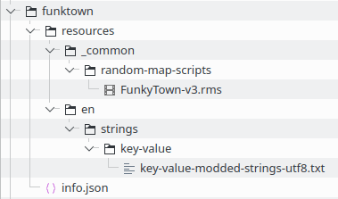
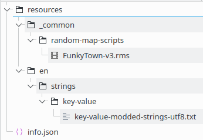

*Written By: Hszemi*

---

Game mods (short for "modifications") allow you to customise your game.
The most common types of mods are:

1. Additional content (like Random Map Scripts, Scenarios, or Campaigns),
2. User Interface mods (like moving the resource bar to the bottom),
3. Graphic mods (like small trees or idle villager pointer),
4. Data mods (like the Exploding Villagers mod or the No Wall mod).

**Mods work by modifying or adding files in your game directory. That's it.**
The hard part is figuring out which files you need to modify, and how.

Of course you can edit files in your game folder directly, but that has the following disadvantages:

- It modifies your vanilla game
- You cannot switch easily between different modifications
- You cannot quickly disable and enable your modifications
- If you break something, you can't simply fetch the original file from your game files and start again

This is solved by bundling your modifications into game mods, which you can then manage comfortably through the in-game mod center.

There are two kinds of mods: Local and subscribed mods.

**Local mods** only exist in a folder on your computer.

**Subscribed mods** are published in the mod center, and you have subscribed to them.

While developing a mod, you usually use a local mod to test your modifications.
Once it is ready, you can publish it so other people can subscribe to it and therefore use it as well.
Published mods can also be updated with a new version.
If you are subscribed to a mod, the game regularly checks for new versions of those mods and downloads them automatically.

## Creating a local mod

First, you need to locate your local mod folder. You can usually find it at the following location:
```
C:\Users\<username>\Games\Age of Empires 2 DE\<number>\mods
```

It contains two folders: A `local` folder, which contains your local mods, and a `subscribed` folder, which contains the mods you subscribed to.

Inside of the `local` folder, create a folder with an arbitrary name that describes your mod.
For demonstration purposes, let's call it `funktown`.

Inside of `funktown`, place all the modified and new files in the same folder structure that you find in the game directory.

For example, if you want to provide a modified version of `resources/en/strings/key-value/key-value-modded-strings-utf8.txt`, you have to create `resources/en/strings/key-value` as subfolders inside of `funktown`, and then place your version of `key-value-modded-strings-utf8.txt` inside of that `key-value` folder.

If you want to also add a new Random Map Script called `FunkyTown-v3.rms` to the random maps selection, you would likewise have to create `resources/_common/random-map-scripts` as subfolders inside of `funktown`, and then place your `FunkyTown-v3.rms` file inside of that `random-map-scripts` folder.

Finally, in order to give your new local mod a recognisable name in the Mod centre, create a file called `info.json` inside of the `funktown` folder and add the following content (you can of course adapt the values):

```json
{
    "Author":"Your Name",
    "CacheStatus":0,
    "Description":"A Description of your liking",
    "Title":"funktown test mod"
}
```

The contents of your `local` mods folder should now look like this:



## Publishing a mod

There are two ways to publish a mod: By publishing it from inside the game, or by uploading it as a zipped archive to the ageofempires.com website


### Publishing from within the game

1. You need to be signed in via XBOX Live inside the game in order to publish mods from within the game.
2. In the mod centre, open the tab "My mods", where your local mods are listed.
3. Select the mod you want to publish, and click "Publish Mod".


### Publishing by uploading a zip file on ageofempires.com

1. Put the contents of your local mod into a zip file, such that the zip file has a structure like this (the `info.json` file is _not_ required):  
   
2. Sign in on ageofempires.com with your XBOX Live account.
3. From the navigation menu, select Mods > Submit a mod.
4. Fill in the appropriate values in the Form.
5. For the Zip File Upload, select the zip file your created at the beginning.
6. Once you submit, your mod is being published.
   Be patient, this may take multiple minutes.


## Updating a published mod

As time goes on, you might want to update or improve your mod.
And then, you of course want to update your published mod, so everyone else can profit from the improvements as well.


### Updating from withing the game

To update a mod via the game:

1. go to the in-game mod menu,
2. go to the "My Mods" tab
3. click the mod that you want to update
4. click "Update Mod"
5. type in the relevant information in the fields provided
6. select the folder that contains your mod using the "Select Folder" option at the top left of the UI
7. click "Publish" and wait for a few seconds. Once the mod is up, you will be redirected to the ageofempires.com page for your mod


### Updating via ageofempires.com

To update a mod via the ageofempires.com website, you:

1. create a new zip file with all the contents of the mod
2. open the mod you want to update on the website and click edit it
3. select your new zip file under "Zip File Upload".
4. you also have the ability to describe what changed in this update in the "Change List" field.
5. click "Submit", wait for a few seconds/minutes, and your mod should be updated.


## Troubleshooting

### 1. Do you have trouble updating / downloading mods or logging in?

Maybe the mod centre simply is going through a phase of having technical issues.
That happens frequently.
Ask fellow modders if they are experiencing the same issues.

### 2. Does the content you added in your mod not show up in game?

Maybe your mod is just disabled.
That happens automatically after a game update.

Maybe your files are not in the right spot.
Double-check your folder names for typos, and your folder structure overall if it matches the one outlined above.

Maybe you are trying to combine a data mod with a User Interface or Content mod.
While that should be possible according to the patch notes, this functionality seems to be broken again.


