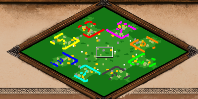
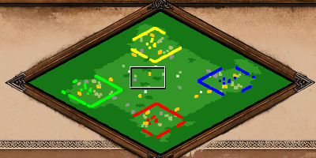
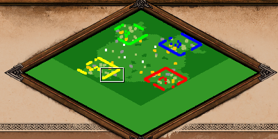
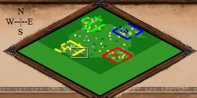

Custom Scenarios allow you to define your own, custom game modes. Literally, they are different "scenarios" the game can be played in.

## The Scenario Editor

The Scenario Editor is the tool that every map maker uses to make and test scenarios.
To open a new scenario in the editor,

1. Click `Single Player` in the main menu
2. Click `Editors`
3. Click `Create Scenario`

To open a saved scenario in the editor,

1. Double-click the scenario from the list in the editors menu in step 3 above

When you load into a new scenario, it is a blank canvas for you to play with!

In the editor, there are quite a few tabs that you can see at the top, their functionalities are discussed below:

## Map

Under the `Map` tab in the editor, there are several options to change the map, they are discussed below:

### Map Style

1. `Blank Map`: This option generates a map of the same terrain throughout the map. The default map that is generated when a new scenario is loaded is a blank map with grass terrain.

2. `Random Map`: This option generates a map from an RMS. (RMS stands for Random Map Script, they are scripts that generate regular maps like Arabia)

3. `Seed Map`: This option generates a map from an RMS using a specified seed. 

What is a seed you ask?

Each generation of a particular RMS in the game has a number attached to it called its "seed" that uniquely identifies that particular generation of the RMS. Generating a map with the same RMS and seed twice will give you the exact same map!

### AI Map Type

This option is used by AIs to figure out what kind of a map they are playing on. This is important if you have AIs in your map because you want them to go for water builds when you have water on your map. Lets say that the map is nomad themed, then setting the `AI Map Type` to `Nomad` would allow AI players to properly play in a nomad style.

### Colour Mood

This setting changes the colour theme (lighting) of the map. By default it is set to `Empty` which means no colour theme. Colour themes are used for aesthetic reasons only and do not effect gameplay. For exmaple, if you are making a map set in the winter season, then using the winter colour theme could be an option.

### Team Positions

This setting is for when you generate maps from an RMS. It determines if players **in the same team** are placed in order of their colour or if they are randomly distributed throughout the map

For example, The teams are currently set to Players 1,3,5,7 vs Players 2,4,6,8 and generating the map with team positions on gives this result:

Notice that players 1,3,5,7 who are on the same team have, generated in that particular order (going counter clockwise in the image) and that players 2,4,6,8 have also generated in that order.

Generating the map with team positions off on the other hand, gives this result:

Notice that now, players 1,3,5,7 who are on the same team, have generated in random positions. Similarly players 2,4,6,8 have generated in no particular order. Also note that even though the positions within the team are random, the players are still grouped on each side of the map by team.

To be more precise, this option generates players in each team in order of their player numbers. Players do not have to be in the specific teams used in the above exmaple for this to work.

### Extend Map

This features is useful for expanding an already existing map if you need to use more space. To use it,

1. Click the checkbox called `Extend Map`.
2. This brings up two new options, `New Map Size` and a `Map Offset`.
3. `New Map Size`: the size of the new map that will be generated.
4. `Map Offset`: determines where to place the existing map on the new map.

For exmaple, Extending this 4 player map with a `New Map Size` of `8 players` and a `Map Offset` of `North`

gives the following result:

Remember, the top corner of the map is North!

### Script Filename

This is the place where you need to enter the name of any XS scripts that you are using in your map. XS scripts are covered in the `XS Scripts` segment of this guide

## Global Victory

Under the `Global Victory` tab in the editor, there are options that allow you to define custom victory conditions for all players. They are all discussed below:

### Standard

A player wins by either defeating all enemies, or capturing 5 relics and holding them for 200 years, or constructing and holding a wonder for 200 years

### Conquest

A player can only win by defeating all enemy players

### Score

The first player to reach the specified score wins

### Time Limit

The game is played until the specified time limit. When the time limit is reached, the player with the highest score wins

### Custom

This victory condition can be customised using the following options:

1. Conquest this is the same as the victory condition in point 2. above
2. Exploration the first player to reach the specified percentage of the map explored wins the game. (There is a text box infront of this option to specify percentage)
3. Relics the first player to capture the specified quantity of relics wins the game. Unlike Standard Victory, a playar wins as soon as they have gathered the relics and do not need to hold them for 200 years. (There is a text box infront of this option to specify quantity)
4. Any One a player can complete any one of the victory condition enabled above to win
5. All a player has to complete all of the victory conditions enabled above to win

## Terrain

Under the `Terrain` tab in the editor, there are a lot of options to modify the terrain of the map. Each of them are discussed below:

### Map

This option allows you to manually place down terrain on the map.

1. `Brush Size`: allows you to pick how large of an area you want to affect on the map at once
2. `Layering Mode`: allows you to blend and layer another type of terrain on top of the base terrain. Note that the terrain properties like buildings that can be placed on terrain are still determined by the base terrain. This means that you won't be able to build buildings on ice layered with grass but you will be able to build buildings on grass layered with ice
3. `Eye Candy`: determines if the terrain you place automatically spawns eye candy on top of it. Eye candy are plants and other units that are generated for aesthetic reasons only, hence the name "eye candy"
4. `No Waves on Shore`: disables waves on water throughout the map
5. `Water Definitions`: this option changes what water looks like throughout the map

Different water definitions are shown below:

`Preset_Main`:

`Preset_FE1`:

`Preset_FE2`:

`Preset_WickedWitch`:

6. `Beach Type`: this option changes the type of beach terrain that is placed down when water terrain is placed. Exploring the different beach types has been left as an excersise for the reader.

### Elevation

This option allows you to change the elevation of existing tiles on the map.

1. `Brush Size`: allows you to pick how large of an area you want to affect on the map at once

*Trick*: In the editor, there are 7 different levels of elevation to chose from, but the elevation can actually have higher or lower values. In the editor, there is no way to make water have elevation either, but it is actually possible to give water elevation as well. Both of these things requires use of external map editing tools and are covered under the `AoE2ScenarioParser` Segment of this guide.

### Cliffs

This option allows you to place cliffs on your map. There are two types of cliffs to chose from, Granite and Sandstone. They function exactly the same, and differ only in their appearence.

*Trick*: a cliff is actually a gaia object that can be rotated, if you go to the `Units` tab, and enable the `Rotate` option, you will be able to click the cliff and rotate it (right click rotates it in the opposite direction). There are a few rotations of the cliff objects that actually do not have graphics for them and hence appear invisible. but since they are still present on the map, just not visible, they block units from going through them. This mechanic can be used to make invisible walls on the map!